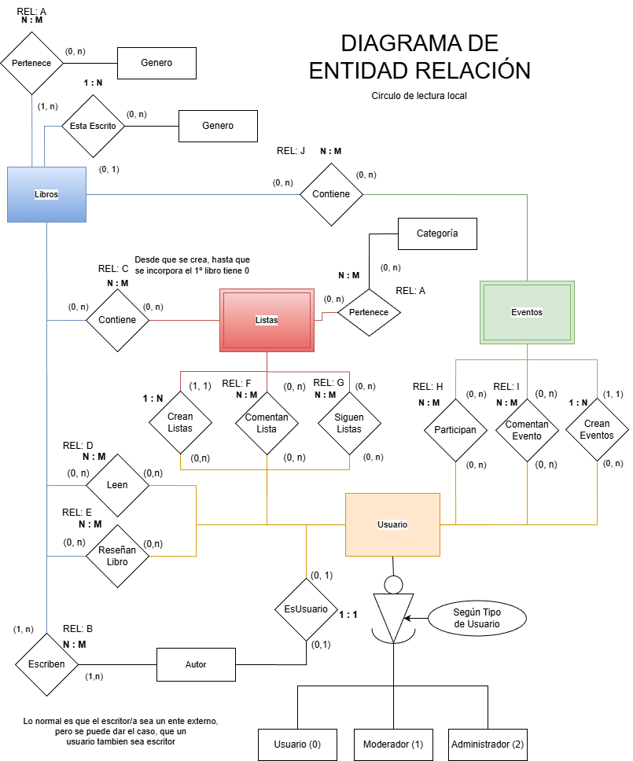
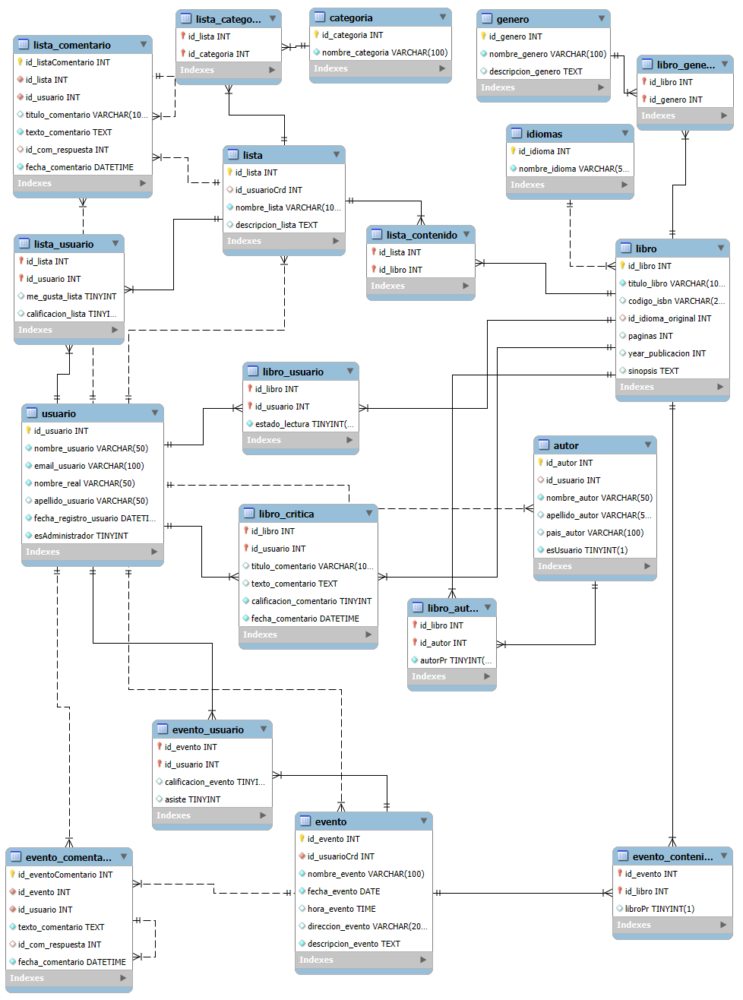
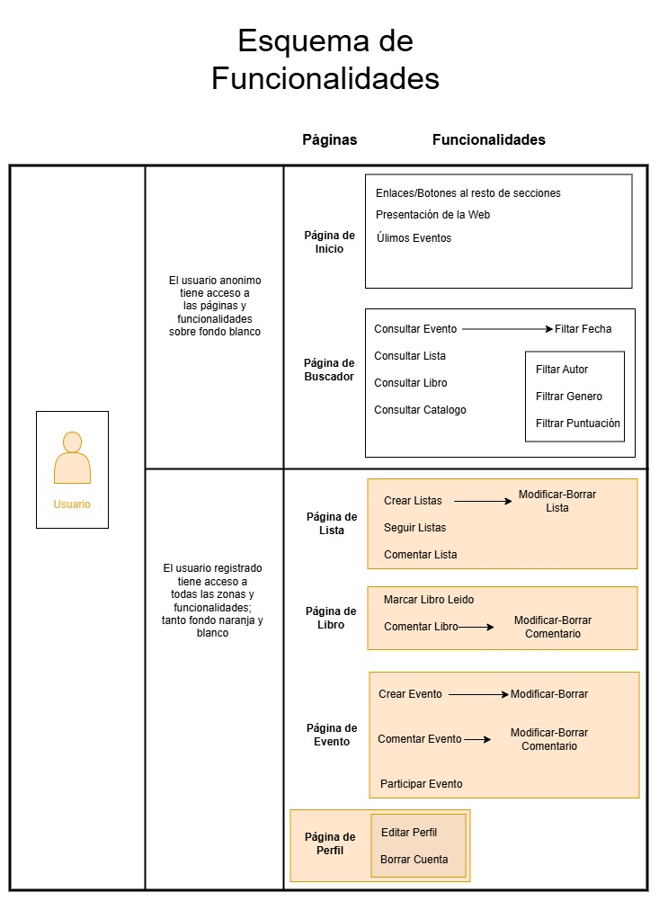
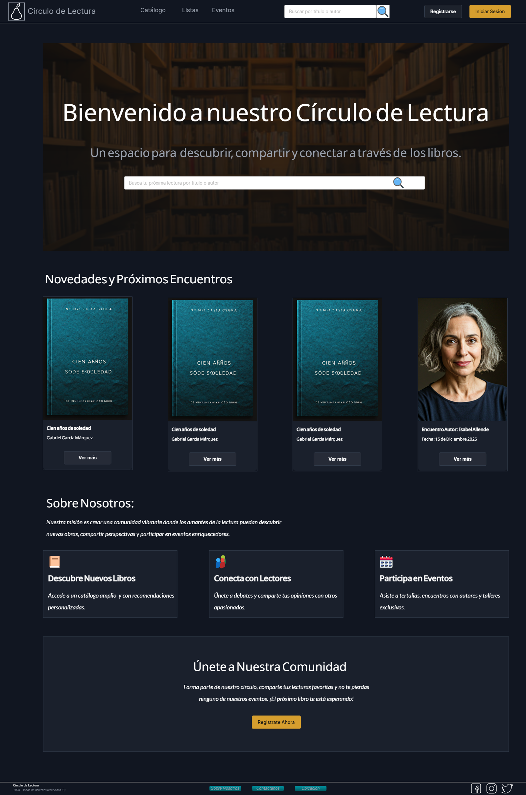
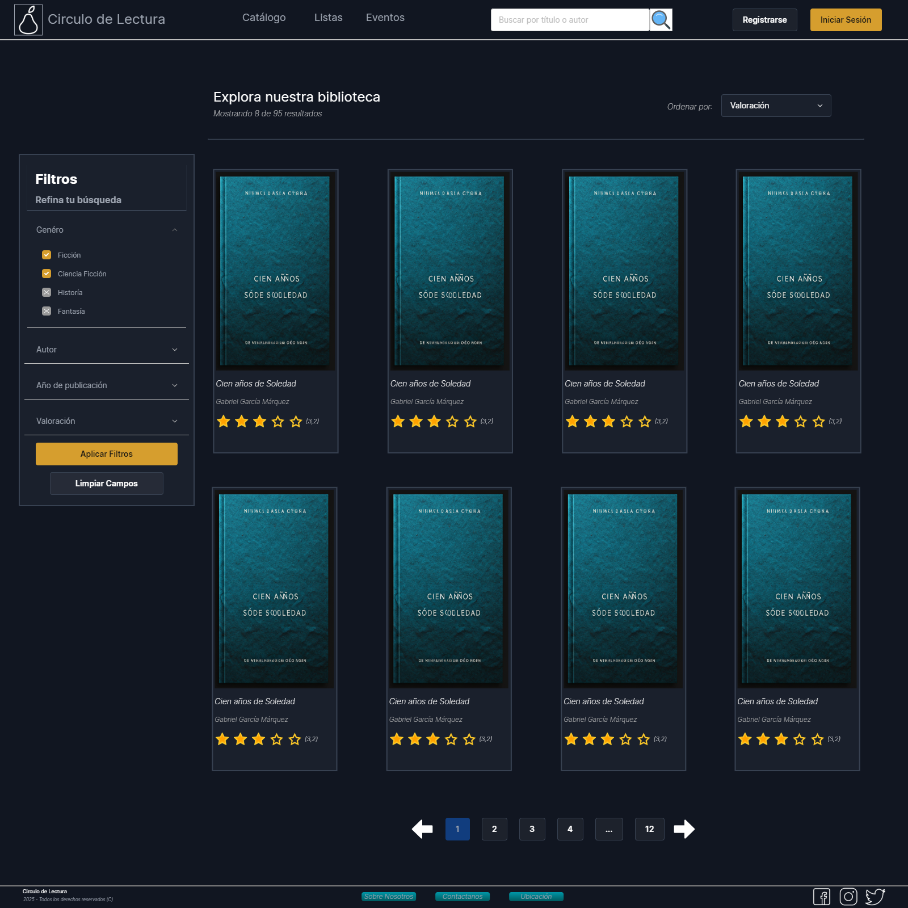
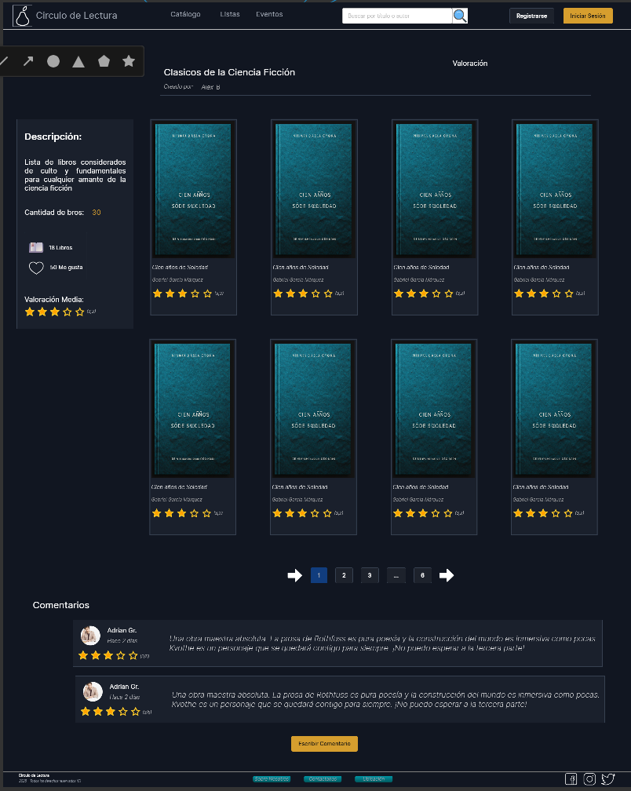
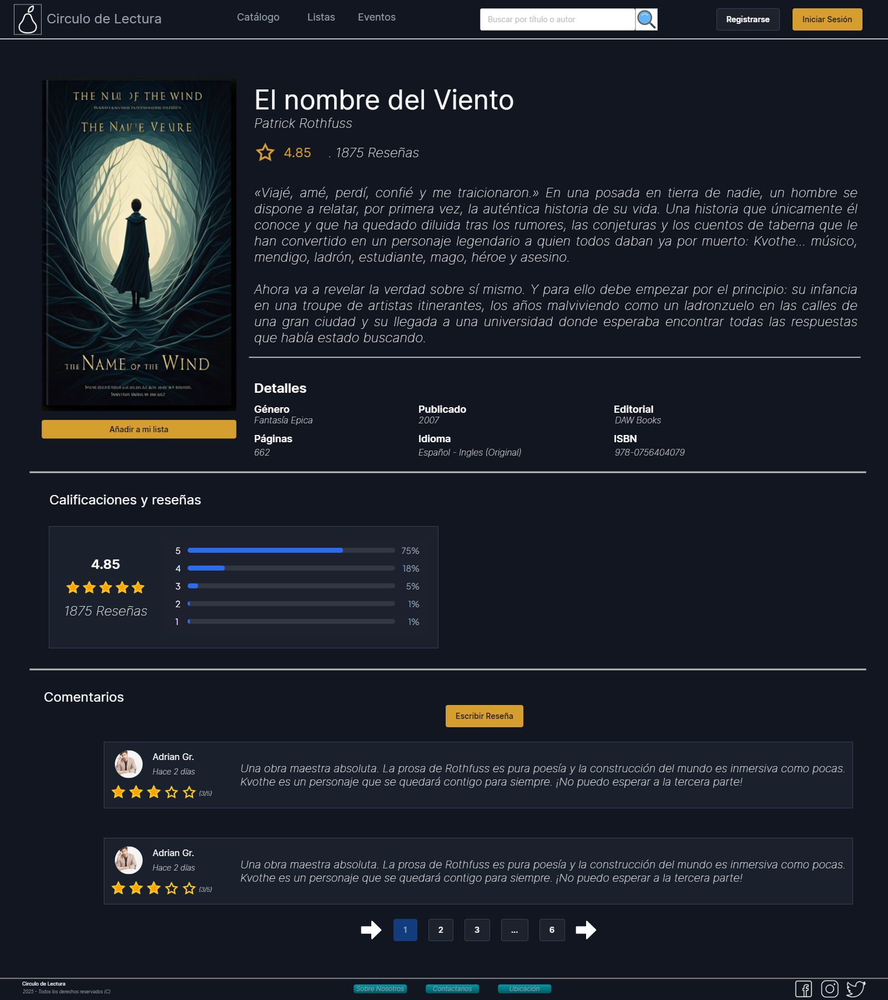
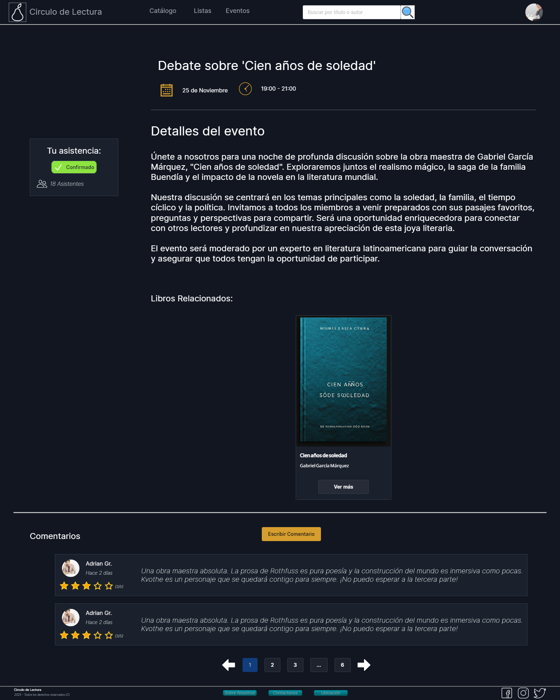
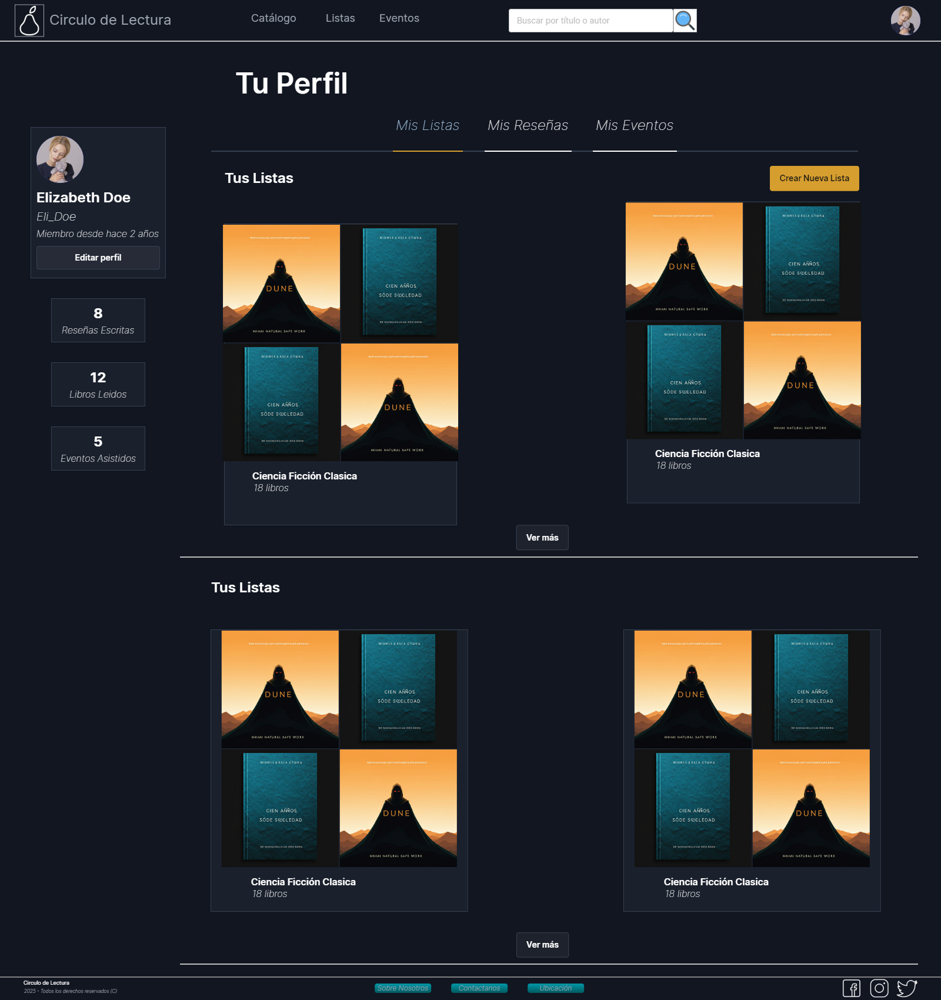

# Memoria Proyecto Final de Ciclo

**Círculo de Lectura – Aplicación Web**

---

## 1. Portada


**Título del proyecto**  
Círculo de Lectura – Plataforma Web para la gestión de un círculo de lectura local

**Denominación del Ciclo Formativo**  
Desarrollo de Aplicaciones Web (DAW)

**Centro educativo**  
IES Suarez de Fígueroa


**Autor del proyecto**  
Gonzalo Lavado Jaén

**Tutor del proyecto**  
José Andrés Paredes Arribas

**Fecha de presentación**  
01/06/2026

**Repositorios del proyecto**

- Frontend: https://github.com/glavadoj01/Circulo_Lectura_Fronted
- Backend: https://github.com/glavadoj01/BackEnd_Circulo_Lectura

---

## 2. Índice

- [Memoria Proyecto Final de Ciclo](#memoria-proyecto-final-de-ciclo)
  - [1. Portada](#1-portada)
  - [2. Índice](#2-índice)
  - [3. Introducción](#3-introducción)
  - [4. Objetivos del proyecto](#4-objetivos-del-proyecto)
  - [5. Justificación del proyecto](#5-justificación-del-proyecto)
    - [5.1 Vinculación contenidos vistos en el Ciclo Formativo](#51-vinculación-contenidos-vistos-en-el-ciclo-formativo)
  - [6. Recursos utilizados](#6-recursos-utilizados)
    - [6.1 Entornos desarrollo](#61-entornos-desarrollo)
    - [6.2 Lenguaje de programación](#62-lenguaje-de-programación)
    - [6.3 Utilidades](#63-utilidades)
  - [7. Tecnologías de desarrollo](#7-tecnologías-de-desarrollo)
  - [8. Diseño del proyecto](#8-diseño-del-proyecto)
    - [8.1 Diseño de la base de datos](#81-diseño-de-la-base-de-datos)
    - [8.2 Carga de datos inicial](#82-carga-de-datos-inicial)
    - [8.3 Diseño de la interfaz de usuario](#83-diseño-de-la-interfaz-de-usuario)
    - [8.4 Roles de la aplicación](#84-roles-de-la-aplicación)
    - [8.5 Usuarios creados para pruebas](#85-usuarios-creados-para-pruebas)
  - [9. Lógica/codificación del proyecto](#9-lógicacodificación-del-proyecto)
  - [10. Despliegue Web del proyecto](#10-despliegue-web-del-proyecto)
  - [11. Manual de usuario](#11-manual-de-usuario)
  - [12. Conclusiones y aspectos a mejorar](#12-conclusiones-y-aspectos-a-mejorar)
  - [13. Bibliografía](#13-bibliografía)
  - [Anexos (opcional)](#anexos-opcional)

---

## 3. Introducción

El proyecto consiste en el desarrollo de una aplicación web destinada a la gestión y dinamización de un círculo de lectura local. La plataforma permite organizar eventos, compartir listas de libros, publicar reseñas y fomentar la interacción entre lectores.

El desarrollo se ha realizado siguiendo principios de accesibilidad, modularidad, seguridad y escalabilidad, integrando una base de datos relacional, un backend en NodeJS/Express y un frontend moderno en Angular.

---

## 4. Objetivos del proyecto

- Crear una plataforma web intuitiva y accesible para gestionar actividades de un club de lectura.
- Implementar un sistema seguro de registro e inicio de sesión.
- Permitir la creación y gestión de listas, reseñas y eventos.
- Facilitar la interacción entre miembros mediante comentarios y valoraciones.
- Aplicar conocimientos adquiridos en el ciclo formativo:
  - Diseño de bases de datos
  - Desarrollo frontend
  - Desarrollo backend
  - Seguridad y accesibilidad
  - Documentación técnica

---

## 5. Justificación del proyecto

### 5.1 Vinculación contenidos vistos en el Ciclo Formativo

El proyecto integra contenidos de:

- **Bases de Datos:** diseño E/R, modelo relacional, SQL.
- **Entornos Cliente:** Angular, HTML5, CSS3, diseño modular.
- **Entornos Servidor:** NodeJS, Express, APIs REST.
- **Despliegue:** hosting local, variables de entorno, CORS.
- **Interfaces:** prototipado con Lunacy.
- **Seguridad:** validación, control de acceso, sanitización.

---

## 6. Recursos utilizados

### 6.1 Entornos desarrollo

- Visual Studio Code
- MySQL Workbench
- Lunacy (prototipado)
- draw.io (diagramas E/R)
- Git + GitHub

### 6.2 Lenguaje de programación

| Parte    | Lenguaje                    | Uso                            |
| -------- | --------------------------- | ------------------------------ |
| Frontend | TypeScript + Angular        | Componentes, servicios, rutas  |
| Backend  | TypeScript + NodeJS/Express | API REST, controladores        |
| BD       | SQL                         | Creación y población de tablas |

### 6.3 Utilidades

- TailwindCSS (Colección de utilidades scss/css)
- Bcrypt (hash para contraseñas)
- CORS (Gestión de acceso)
- DotEnv (Gestión Variables Entorno)
- APIs propias del backend
- Recursos visuales de referencia (Filmaffinity, IMDB, etc.)

---

## 7. Tecnologías de desarrollo

- REST API
- MySQL
- NodeJS + Express
- Angular 22
- TailwindCSS
- TypeScript
- CORS + dotenv
- Bcrypt

---

## 8. Diseño del proyecto

### 8.1 Diseño de la base de datos

**Diagrama E/R**



**Modelo Relacional**



**Diágrama de Funcionalidades**



Incluye entidades como:

- Usuario
- Libro
- Lista
- Evento
- Autor
- Género
- Comentarios y valoraciones

### 8.2 Carga de datos inicial

Scripts incluidos en [anexos](https://github.com/suarezfigueroa/2025-2026_GonzaloLavado/anexos/scriptsBD):

- `creacion.sql`
- `poblacionInicial.sql`

### 8.3 Diseño de la interfaz de usuario

Prototipos realizados con Lunacy: [Enlace a Lunacyd](https://www.lunacyapp.com/eu/CncRnbg-uUilN9kWvV7aqQ/Circulo-Lectura)

- Inicio

  

- Catalogo de Libros

  

- Detalle de una Lista

  

- Detalle de un Libro

  

- Detalle de un Evento

  

- Perfil de usuario

  

Características:

- Diseño modular basado en componentes
- Tema oscuro/claro
- Reutilización de tarjetas y layouts
- Filtros reactivos
- Paginación dinámica

### 8.4 Roles de la aplicación

- **Usuario anónimo** – Consulta contenido público
- **Usuario registrado** – Comenta, crea listas, participa en eventos
- **Moderador** – Gestión de contenido (editar contenido)
- **Administrador** – Control total del sistema (editar contenido + borrar usuarios)

### 8.5 Usuarios creados para pruebas

- Usuario 1 (Administrador)
- Usuarios ficticios generados para reseñas y comentarios
- Se puede crear usuarios nuevos

---

## 9. Lógica/codificación del proyecto

- Arquitectura basada en componentes y servicios
- Backend estructurado en controladores, rutas y servicios
- Clase centralizada `ConexionBD` para CRUD
- Validación de datos y sanitización
- Gestión de errores y estados de carga
- Sistema de carpetas:

- Estructura básica

  ```bash
  src/
  ├── app/
  │   ├── pages/
  │   ├── services/
  │   ├── shared/components/
  │   └── models/
  └── backend/
      ├── controllers/
      ├── routes/
      ├── services/
      └── scriptsBD/
  ```

- Estructura Front

```bash
Circulo_Lectura_Fronted/
├── src/
│   ├── environments/                                       # Configuración de entornos
│   │   ├── environments.ts                                     # Usar para desarrollo local
│   │   └── _environments.ts                                    # Versión limpia para compartir y editar
│   └── app/
│       ├── app.ts, app.routes.ts, app.html, app.config.ts  # Configuración y entrada principal
│       │── interfaces/                                     # Modelos de datos
│       │   ├── modelosApp/                                     # Modelos utilizados en la App
│       │   └── modelosBD/                                      # Modelos utilizados en la BD
│       ├── pages/                                          # Páginas de la aplicación
│       │   ├── auth/                                           # auth.ts, auth.html, auth.css
│       │   ├── bienvenida/                                     # bienvenida.ts, bienvenida.html
│       │   ├── catalogos/                                      # libros, listas, eventos (cada uno con sus archivos .ts y .html)
│       │   ├── condicionesYTerminos                            # Terminos y condiciones de uso
│       │   ├── detalle/                                        # evento, libro, lista (cada uno con sus archivos .ts y .html)
│       │   └── perfilUsuario/                                  # perfil.ts, perfil.html
│       ├── services/                                       # Servicios de la aplicación
│       │   ├── servicioLibros/                                 # Relacionados con Libros
│       │   ├── servicioListas/                                  # Relacionado con Listas
│       │   ├── servicioUsuario/                                 # ServiciosDePerfil
│       │   └── themeService/                                    # Gestiona el cambio de tema claro/oscuro (WIP - Paleta)
│       └── shared/
│           ├── components/                      # Componentes reutilizables y/o especificos con logica
│           ├── pipes                           # Trasnformaciones Visuales sobre el DOM
│           └── utils                           # Utilidades/Funciones auxiliares y genericas
```

- Estructura Back

```bash
BackEnd_Circulo_Lectura/
├── .env                    # Variables de entorno (local, no versionar)
├── _.env                   # Plantilla de ejemplo de entorno
├── src/
│   ├── main.ts                # Punto de entrada
│   ├── Controllers/           # Lógica de negocio
│   ├── Routes/                # Definición de rutas
│   ├── Services/              # Servicios y conexión BD
│   ├── Interfaces/            # Modelos de datos
│   └── Utils/                 # Utilidades y validaciones
├── scriptsBD/                 # Scripts SQL
├── package.json               # Dependencias y scripts npm
├── tsconfig.json              # Configuración TypeScript
└── README.md                  # Este archivo
```

- Estructura del arranque-funcionamiento

```bash
main.ts                                         # Ejecuta la verificación de variables e inicia el servidor
  └── server/index.ts                               # Exporta la instancia final
        └── server/express.ts                       # Crea y configura el servidor
              ├── cors.ts                           # Exporta la configuración de acceso CORS
              └── routes/                           # Exporta las rutas y asocia a un metodo de controlador
                    ├── controladores/
                    │      └── servicios/
                    │             └── ConexionBD    # Servicio Central de Conexión
                    └── middlewares                 # Intercepta las rutas y verifica accesos
```

---

## 10. Despliegue Web del proyecto

- Requisitos: NodeJS, MySQL, Angular CLI
- Variables de entorno en `.env`
- CORS configurado para acceso local
- Scripts de inicio:

  ```bash
  npm install     # ambos
  npm run start   # backend
  npm run start   # frontend
  ```

- Reset de BD:

  `GET http://localhost:3000/resetAPI` (Navegador/Postman)

---

## 11. Manual de usuario

Incluye:

- Navegación general
- Uso del catálogo
- Detalle de libros y listas
- Perfil de usuario
- Roles y permisos
- Creación de usuarios

Cuenta de Administrador

- usuario: `usuario1@example.com`
- contraseña: `1Ab@3456789`

Tokens de sesiones para pruebas del back/Postman

- Tokens Expirados:
  - `seed-session-expirada-1`
  - `seed-session-expirada-2`
- Token Caduca en 5 minutos
  - `seed-session-5m-1`
- Token Caduca en 10 minutos
  - `seed-session-10m-1`
- Token Caduca en 1 semana
  - `seed-session-semana-2`

Estos token han sido insertados manualmente en la tabla de sesiones desde el script de poblacionInicial. El funcionamiento real en tiempo de ejecucción se realiza mediante `bcrypt`.

---

## 12. Conclusiones y aspectos a mejorar

- El diseño modular ha permitido una evolución fluida del proyecto.
- La integración front–back mediante TypeScript ha reducido errores.
- El sistema de temas está operativo, pero falta definir la paleta clara.
- La BD ha requerido ajustes durante el desarrollo mediante ciclos PDCA.
- Queda pendiente la definición de paleta de colores clara.
- Para versiones futuras, se podría mejorar/optimizar el nº de llamadas front-back.

---

## 13. Bibliografía

- Filmaffinity – https://www.filmaffinity.com
- IMDB – https://www.imdb.com
- Menéame – https://www.meneame.net
- Wikipedia – https://es.wikipedia.org
- Teslo Shop – https://tesloshop-gc.vercel.app
- Generador de rostros – https://thispersondoesnotexist.com
- BD de imagenes - https://picsum.photos/
- Documentación Angular, NodeJS, MySQL

---

## Anexos (opcional)

- **Anexo I:** [Instalación Requisitos.md](anexos/01-Instalación_Requisitos.md)
- **Anexo II:** [Rutas para peticiones de ejemplo](https://github.com/suarezfigueroa/2025-2026_GonzaloLavado/anexos/02-Rutas_Back_Ejemplos.pdf)
- **Anexo III:** [Diagramas y prototipos](https://github.com/suarezfigueroa/2025-2026_GonzaloLavado/blob/main/anexos/Diagramas/)
- **Anexo IX**: [Entregas Pasadas](https://github.com/suarezfigueroa/2025-2026_GonzaloLavado/blob/main/anexos/Presentaciones_Pasadas/)
